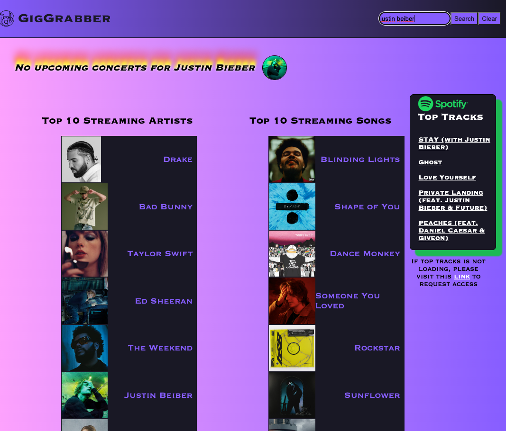
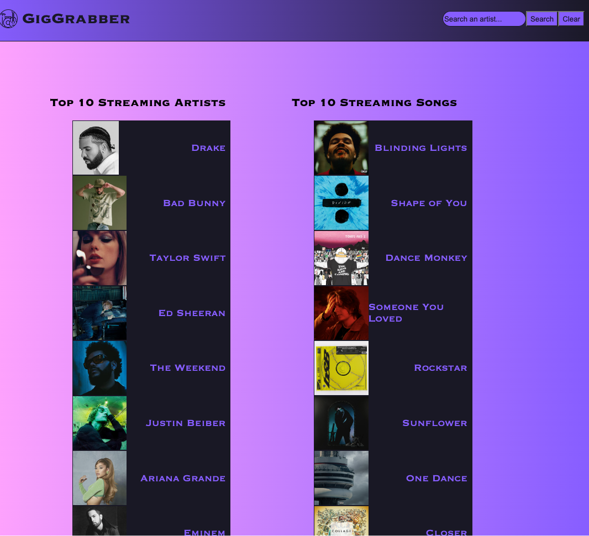
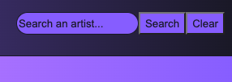
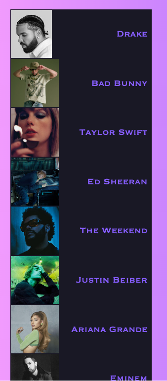
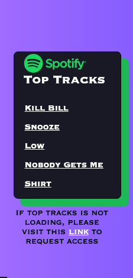
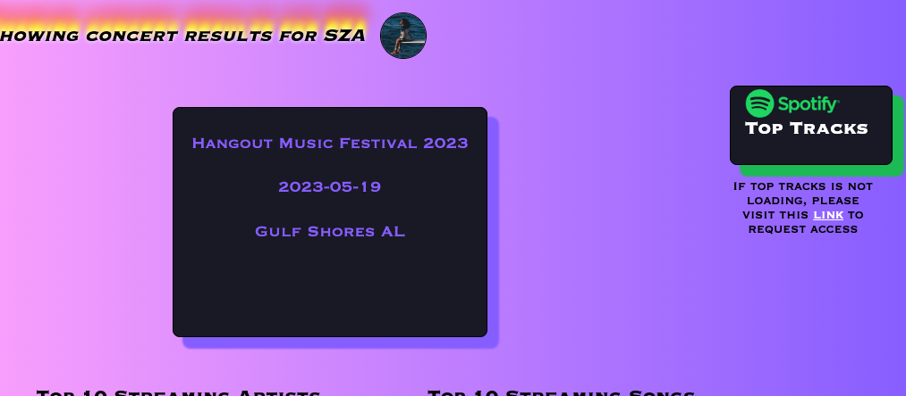

# GigGrabbers

## Repository Description

GitGrabber (GG) is a dynamic concert search engine that allows you to easily find upcoming concerts for your favorite artists. Our comprehensive database is updated daily to ensure that you have access to the latest tour information, and our user-friendly interface makes it easy to search for concerts by artist name and preferred location. GG will even display their top songs on Spotify, so that you can easily listen to their most popular tracks and get hyped for their upcoming concert! Whether you’re a die-hard fan looking for front-row tickets or just someone who loves live music, GG is your go-to resource for finding the hottest concerts in town. 

## User Story

AS A music lover,
I WANT to quickly search for my favorite artists 
SO THAT I can easily keep track of my favorite artist’s tour schedules & plan my concert-going experiences with ease.

## Acceptance Criteria

GIVEN I want to search for my favorite artists’ concert/ tour dates
WHEN I search the artist name
THEN I am presented with a list of future performances 
THEN I am also presented with the artists’ top song and artist icon
When I search the artist name
THEN I can view my previous search history

## Installation

If you would like to listen to an artist's top songs and the top songs are not loading, you will need to request access. To do so, you will need to click on "link". Once you click on "link", you wil be directed to cors-anywhere.herokuapp.com/corsdemo. To unlock access to the demo, click on the button "Request temporary access to the demo server." Click on the back button to go back to GigGrabbers and you will now be able to see the artist's top 5 songs. 

## APIs Used 

For this assignment, we used two API's. We used the Bandsintown API so that you can search if an artist has any upcoming events. Then used the Spotify API so that you can listen to an artists top song.  

## Usage

Once you enter the website, input an artists name on the top right of the screen and click on the search button. Once you click on the search button, you will be informed on whether or not the artist has any upcoming events. If the artist has an upcoming event, you will be provided with a list of their upcoming events. If the artist has no upcoming events, you will be informed that the artist has no upcoming events. Lastly, if you search an artist that does not exist or misspelled an artists' name, you will be informed that there are no results found for that artist. To clear your search history, click on the clear button on the top right of the screen right next to the search button. To listen to an artist's top tracks, you might first need to request access by clicking on the link directly below the spotify container. Once you request access, you may click on one of the top tracks and you will be directed to Spotify. If you would like to see wether the top 10 streaming artists has any concerts, you can click on their name. 

## Credits

We would like to thank our instructor Brian for helping us set up the Spotify API. We would also like to thank our TA for providing us with words of encouragement during this stressful time.
## License

Please refer to the License in repo.

## Deployment

https://kriskris9.github.io/Project-1/